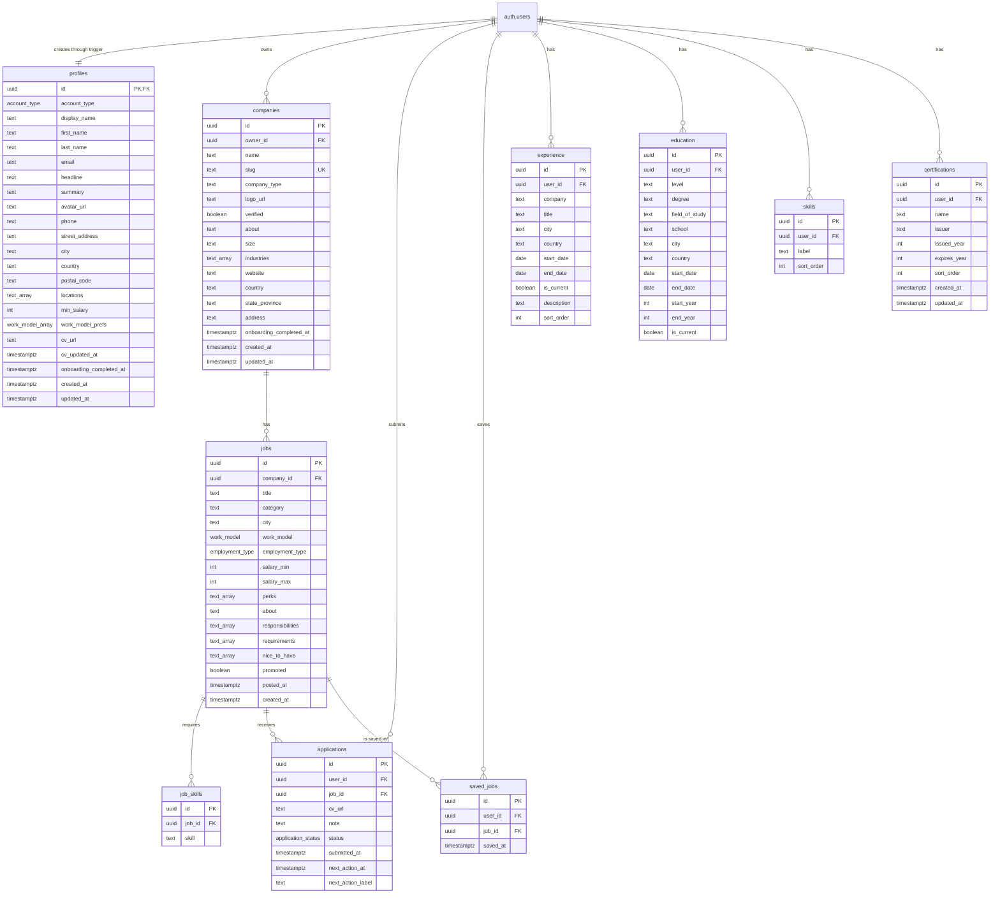

# StellarJob database and data-flow reference

This document describes the database contract currently used by `apps/web`.

## Source of truth

Use these sources in this order:

1. `supabase/migrations/*.sql` — authoritative schema, grants, RLS policies, functions, and triggers. Apply the files in timestamp order.
2. `packages/supabase/src/database.types.ts` — generated TypeScript snapshot of the deployed Supabase schema.
3. This document — human-readable architecture reference.

`apps/web/src/db/schema.sql` is retained as historical reference only. Do not apply it over a database that is managed by the root migrations.

## Current implementation status

StellarJob uses Supabase for both account types. The records below are not supplied by hard-coded applicant or employer fixtures.

| Area | Supabase-backed behavior in the current app |
| --- | --- |
| Authentication | Supabase Auth handles sign-up, sign-in, Google OAuth, email verification, sessions, and sign-out. |
| Applicant | Reads and updates the applicant profile; persists experience, education, skills, certifications, saved jobs, and applications; reads jobs and companies. |
| Employer (hirer) | Reads the employer profile and persists the employer-owned company and onboarding state. |
| Guest | Reads jobs and verified companies. |

The employer implementation is currently narrower than the applicant implementation: employer authentication and company onboarding are connected to Supabase, but employer job creation, applicant review, and employer analytics screens are not implemented yet. The database currently restricts writes to `jobs` and `job_skills` to the `service_role`.

Files under `apps/web/src/data/` contain static UI configuration such as company types, countries and regions, onboarding steps, month/year choices, and display copy. They are not the source of applicant profiles, employer companies, saved jobs, or applications.

## Entity relationship diagram

`companies.owner_id` is nullable so seeded or platform-managed companies can exist without an employer owner. A user normally has one application profile, but an employer can technically own more than one company because the schema does not place a unique constraint on `companies.owner_id`; the current server functions operate on the employer's newest company.

## Relationships and deletion behavior

| Child column | Parent column | On parent deletion |
| --- | --- | --- |
| `profiles.id` | `auth.users.id` | Cascade |
| `companies.owner_id` | `auth.users.id` | Cascade |
| `jobs.company_id` | `companies.id` | Cascade |
| `job_skills.job_id` | `jobs.id` | Cascade |
| `applications.job_id` | `jobs.id` | Cascade |
| `saved_jobs.job_id` | `jobs.id` | Cascade |
| `applications.user_id` | `auth.users.id` | Cascade |
| `saved_jobs.user_id` | `auth.users.id` | Cascade |
| `experience.user_id` | `auth.users.id` | Cascade |
| `education.user_id` | `auth.users.id` | Cascade |
| `skills.user_id` | `auth.users.id` | Cascade |
| `certifications.user_id` | `auth.users.id` | Cascade |

Important uniqueness rules:

- A user can apply to a job only once: `applications (user_id, job_id)`.
- A user can save a job only once: `saved_jobs (user_id, job_id)`.
- A job cannot contain the same skill twice: `job_skills (job_id, skill)`.
- A user cannot contain the same skill label twice: `skills (user_id, label)`.
- Non-null company slugs are unique.

## Enums

| Enum | Values | Used by |
| --- | --- | --- |
| `account_type` | `applicant`, `employer` | `profiles.account_type` |
| `work_model` | `remote`, `hybrid`, `onsite` | `jobs.work_model`, `profiles.work_model_prefs` |
| `employment_type` | `full_time`, `part_time`, `contract`, `internship` | `jobs.employment_type` |
| `application_status` | `applied`, `reviewing`, `interview`, `offer`, `not_selected`, `closed` | `applications.status` |

## Authorization and row-level security

The web app uses the cookie-backed Supabase server client in `apps/web/src/lib/supabase/server-client.ts`. It uses the publishable/anonymous key and the signed-in user's session, so Postgres grants and RLS policies remain the authorization boundary. The browser is never given the `service_role` key.

| Table | Anonymous access | Authenticated access | Current write rules |
| --- | --- | --- | --- |
| `profiles` | None | Select own profile | Own profile can update only the granted profile columns. Insert is performed by the auth trigger; Data API insert/delete is not granted. |
| `companies` | Select verified companies | Select verified companies plus own company drafts | Employer can insert an owned company and update an allow-list of fields on owned rows. `owner_id` and `verified` cannot be changed through the Data API. Delete is not granted. |
| `jobs` | Select | Select | `service_role` only |
| `job_skills` | Select | Select | `service_role` only |
| `applications` | None | Select own applications | Insert only `user_id`, `job_id`, and `note`; RLS requires the signed-in, fully onboarded applicant to be the row owner. Update/delete is not granted. |
| `saved_jobs` | None | Select own saved jobs | Insert/delete own rows. The application server function additionally requires an applicant account. |
| `experience` | None | Select own rows | Insert/update/delete own rows |
| `education` | None | Select own rows | Insert/update/delete own rows |
| `skills` | None | Select own rows | Insert/update/delete own rows |
| `certifications` | None | Select own rows | Insert/update/delete own rows |

## Database functions and triggers

| Function | Trigger | Purpose |
| --- | --- | --- |
| `handle_new_user()` | `on_auth_user_created`, after insert on `auth.users` | Creates the matching profile and copies the account type, display name, email, and avatar metadata. Unknown account types default to `applicant`. |
| `set_updated_at()` | `profiles_set_updated_at`, `companies_set_updated_at`, `certifications_set_updated_at` | Replaces `updated_at` with database time before an update. |
| `enforce_applicant_onboarding_completion()` | `profiles_enforce_onboarding_completion`, before profile update | Keeps `account_type` immutable, prevents clearing completion, checks required applicant fields, and replaces a newly supplied completion timestamp with database time. |
| `enforce_company_onboarding_completion()` | `companies_enforce_onboarding_completion`, before company update | Keeps `owner_id` and `verified` immutable, prevents clearing completion, checks required company fields, and replaces a newly supplied completion timestamp with database time. |

The internal trigger functions are not executable directly by `public`, `anon`, or `authenticated` roles.

## Onboarding state

| Account | Flow | Completion field | Required before completion |
| --- | --- | --- | --- |
| Applicant | `/onboarding/profile`, then `/profile/onboarding` | `profiles.onboarding_completed_at` | Applicant account type plus nonblank first name, last name, city, and country |
| Employer | `/employer/onboarding` | `companies.onboarding_completed_at` | Owned company with nonblank name, company type, country, state/province, and address |

`profiles.account_type` controls the post-authentication redirect and which server actions the account may use. Application submission is protected twice: the server function checks the account and onboarding state, and the insert RLS policy checks them again in Postgres.

## Runtime data flow

| Route or feature | Supabase reads | Supabase writes |
| --- | --- | --- |
| `/`, `/find-jobs` | `jobs`, related `companies`, verified-company list | None |
| `/employers` | Verified `companies` | None |
| `/search` | Filtered `jobs` and related `companies` | None |
| `/jobs/$jobId` | Job, company, and job skills; current user's saved state | Toggle current applicant's `saved_jobs` row |
| `/jobs/$jobId/apply` | Job and current applicant profile preview | Insert one `applications` row |
| `/dashboard` | Current applicant profile, applications, saved jobs, and jobs | None |
| `/applications` | Current applicant's applications with jobs and companies | None |
| `/saved` | Current applicant's saved jobs with jobs and companies | None; saving and removing happen on the job-detail route |
| `/profile` | Current profile, experience, education, skills, and certifications | Update profile and synchronize owned child rows |
| `/profile/onboarding` | Same applicant profile data | Update applicant records and complete onboarding |
| `/employer/onboarding` | Current employer's newest owned company | Insert/update the company and complete onboarding |
| Sign-in and sign-up routes | Supabase Auth session/user | Auth user; profile is created by the database trigger |

## Zod validation

Zod is actively used. It validates untrusted route/search input and server-function payloads before business logic runs.

| Module | What Zod validates |
| --- | --- |
| `apps/web/src/lib/auth/auth.functions.ts` | Email, password, account type, OAuth mode, authorization code, and redirect target |
| `apps/web/src/lib/jobs/job-search-schema.ts` | Search text, location, work models, employment types, salary, posting age, sort order, and pagination |
| `apps/web/src/lib/jobs/job.functions.ts` | Job IDs, saved-job toggles, and application notes |
| `apps/web/src/lib/profile/profile.functions.ts` | Applicant profile fields and nested experience, education, certification, and skill collections |
| `apps/web/src/lib/employer/company.functions.ts` | Company basics, address, website, size, and description |

TanStack Start's `.validator(...)` attaches these schemas to server functions, while the job-search schema also provides safe URL-search defaults with Zod's `.catch(...)`. Zod validates shape and field-level rules; it does not replace Supabase Auth, RLS, grants, foreign keys, unique constraints, or database triggers.
