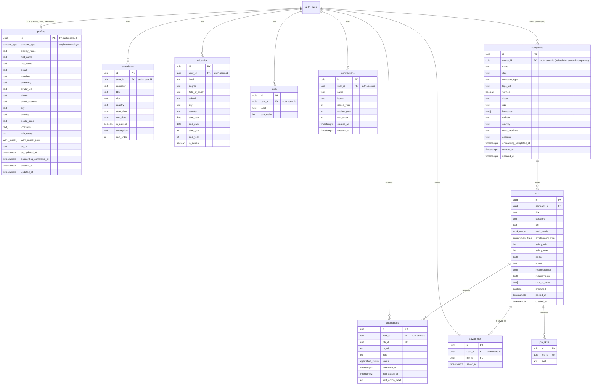

# StellarJob — Entity Relationship Diagram

Reflects the current Supabase Postgres schema — see `src/integrations/supabase/types.ts`. User-owned tables are RLS-scoped to `auth.uid()`. `companies`, `jobs`, and `job_skills` are public-readable; `companies` is additionally owner-writable so employers can register and maintain their own company. Everything else is owner-only.

## Enums

| Enum                 | Values                                                                 | Used by                                        |
| -------------------- | ---------------------------------------------------------------------- | ---------------------------------------------- |
| `account_type`       | `applicant`, `employer`                                                | `profiles.account_type`                        |
| `work_model`         | `remote`, `hybrid`, `onsite`                                           | `jobs.work_model`, `profiles.work_model_prefs` |
| `employment_type`    | `full_time`, `part_time`, `contract`, `internship`                     | `jobs.employment_type`                         |
| `application_status` | `applied`, `reviewing`, `interview`, `offer`, `not_selected`, `closed` | `applications.status`                          |

## Database functions

| Function            | Purpose                                                                                                                                                                                                                                                       |
| ------------------- | ------------------------------------------------------------------------------------------------------------------------------------------------------------------------------------------------------------------------------------------------------------- |
| `handle_new_user()` | Trigger on `auth.users` insert — creates a matching `profiles` row and sets `account_type` from signup metadata (`employer`, otherwise defaults to `applicant`). Also copies `display_name` / `full_name` / `name` and `avatar_url` from the signup metadata. |
| `set_updated_at()`  | Generic trigger that stamps `updated_at = now()` on row update.                                                                                                                                                                                               |

## Triggers

| Trigger                         | Table                   | Timing        | Function            |
| ------------------------------- | ----------------------- | ------------- | ------------------- |
| `on_auth_user_created`          | `auth.users`            | AFTER INSERT  | `handle_new_user()` |
| `profiles_set_updated_at`       | `public.profiles`       | BEFORE UPDATE | `set_updated_at()`  |
| `companies_set_updated_at`      | `public.companies`      | BEFORE UPDATE | `set_updated_at()`  |
| `certifications_set_updated_at` | `public.certifications` | BEFORE UPDATE | `set_updated_at()`  |

Only these three public tables carry `updated_at`; every other table is append/replace-style and tracks time via `created_at`, `submitted_at`, `saved_at`, or `posted_at`.

## Access matrix

| Table                                                    | anon SELECT | authenticated SELECT | authenticated INSERT/UPDATE/DELETE      |
| -------------------------------------------------------- | ----------- | -------------------- | --------------------------------------- |
| `profiles`                                               | —           | own row              | insert/update own row (no delete)       |
| `companies`                                              | ✓           | ✓                    | own rows only (`owner_id = auth.uid()`) |
| `jobs`                                                   | ✓           | ✓                    | service_role only                       |
| `job_skills`                                             | ✓           | ✓                    | service_role only                       |
| `applications`                                           | —           | own rows             | own rows                                |
| `saved_jobs`                                             | —           | own rows             | insert/delete own rows (no update)      |
| `experience` / `education` / `skills` / `certifications` | —           | own rows             | own rows                                |

## Onboarding state

Two independent onboarding flows, each tracked by its own timestamp:

| Flow                                                                                                          | Route                  | Completion flag                     |
| ------------------------------------------------------------------------------------------------------------- | ---------------------- | ----------------------------------- |
| Applicant profile wizard (name → location → experience → education → certifications → skills → review → done) | `/profile/onboarding`  | `profiles.onboarding_completed_at`  |
| Employer company registration (company details → address & web presence)                                      | `/employer/onboarding` | `companies.onboarding_completed_at` |

`profiles.account_type` decides which flow a new account is redirected into after sign-up.

## Which screen reads which table

| Route                    | Reads                                                                                         | Writes                                                            |
| ------------------------ | --------------------------------------------------------------------------------------------- | ----------------------------------------------------------------- |
| `/` (landing, guest)     | `jobs` (with `companies`), aggregate counts                                                   | —                                                                 |
| `/find-jobs` (guest)     | `jobs` (with `companies`)                                                                     | —                                                                 |
| `/employers` (guest)     | `companies`                                                                                   | —                                                                 |
| `/search`                | `jobs` (with `companies`, filters)                                                            | —                                                                 |
| `/jobs/$id`              | `jobs` (with `companies`, `job_skills`), similar `jobs`                                       | —                                                                 |
| `/jobs/$id/apply`        | `profiles` (own), latest `applications` for this job by user                                  | `applications` (insert)                                           |
| `/dashboard` (applicant) | `profiles` (own), `applications`, `saved_jobs`, recommended `jobs`                            | —                                                                 |
| `/applications`          | `applications` (own, with `jobs` + `companies`)                                               | `applications` (update)                                           |
| `/saved`                 | `saved_jobs` (own, with `jobs` + `companies`)                                                 | `saved_jobs` (delete)                                             |
| `/profile`               | `profiles` (own), `experience`, `education`, `skills`, `certifications`, `applications` count | all of the above (upsert)                                         |
| `/profile/onboarding`    | `profiles` (own), `experience`, `education`, `skills`, `certifications`                       | same tables (upsert, sets `profiles.onboarding_completed_at`)     |
| `/employer/onboarding`   | `companies` (own)                                                                             | `companies` (upsert, sets `owner_id` + `onboarding_completed_at`) |
| `/sign-in`, `/sign-up`   | `auth.users` (via Auth)                                                                       | Auth + `profiles` (via trigger)                                   |
